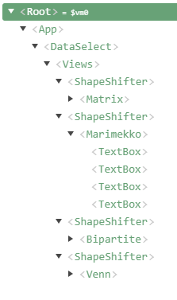
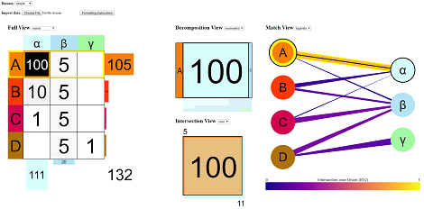

# ConfusionMatrixViewer
## Confusion Matrix Viewer from Luke Hartman's Honors Project

# [Demo](http://graphics.cs.wisc.edu/Vis/partcomp/)

This Visualization Tool compares two Partitionings of the same data where nothing other than the partition labels is known. Example use cases include:
+ inspecting weighted bipartite graphs (with non-negative weights)
+ comparing the results of two clusterings of the same data
+ looking at predicted classifications versus the ground truth values
+ exploring the relationship between two categorical features of a dataset

In general, it is compatible with any data that can be represented as a matrix with non-negative values.

## Explanation of Structure
 

### This project uses Vue, and is composed of a few levels of nested components.

1. At the highest level is DataSelect which contains the information at the top, allowing the user to change the data that is being shown, or upload their own.
2. Below that is a Views component, which has a specific example configuration of the visualization components.
3. The Views component contains multiple ShapeShifter components which can change between a given list of visualizations (below).

#### Visualization components:
+ Matrix: a standard confusion matrix with side bar charts
+ MarkerMatrix: the same matrix with the cells using a size encoding
+ Marimekko: a Marimekko Chart (Row/Column Chart)
+ Pie: a two level pie chart
+ Venn: a square Venn Diagram with proportional area
+ Bipartite: a bipartite graph visualization

The Views component takes in only a single property, 'dataset' which is an object in the form:

	{
		matrix: [[100, 5, 0], [10, 5, 0], [1, 5, 0], [0, 5, 1]],
		rows: [{label: 'A', color: '#fc7f03'},
			   {label: 'B', color: '#fc3903'},
			   {label: 'C', color: '#d1024e'},
			   {label: 'D', color: '#ae700a'}],
		cols: [{label: 'α', color: '#d6fffb'},
			   {label: 'β', color: '#b3e3f4'},
			   {label: 'γ', color: '#a2faa3'}],
	}
	
The visualization components take in the 'matrix', 'rows', 'cols' elements of this dataset, additional information about what 'row' and 'col' the selected cell is in, and whether the focus is on a row or column view ('rowSelected').

To control these components, the ShapeShifter component takes in all these properties with the addition of a 'selection' which is a list containing the names of the components it can take the appearance of.

If you plan on using the components for this visualization, it is up to you how much you would like to customize it to your purposes. Here are some recommended approaches:
+ Take the Views component as is
+ Modify Views to suit your use case
+ Use the visualization components directly (you will need to drive the the interactivity)